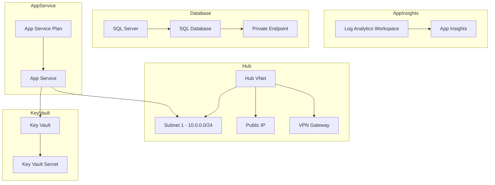

# WebApp with vnet integration

```mermaid
graph TD
    subgraph Hub
        A[Hub VNet]
        A1[Subnet 1 - 10.0.0.0/24]
        A2[Public IP]
        A3[VPN Gateway]
    end

    subgraph AppInsights
        B[Log Analytics Workspace]
        C[App Insights]
    end

    subgraph Database
        D[SQL Server]
        E[SQL Database]
        F[Private Endpoint]
    end

    subgraph KeyVault
        G[Key Vault]
        H[Key Vault Secret]
    end

    subgraph AppService
        I[App Service Plan]
        J[App Service]
    end

    A --> A1
    A --> A2
    A --> A3
    B --> C
    D --> E
    E --> F
    G --> H
    I --> J
    J --> A1
    J --> G
```
